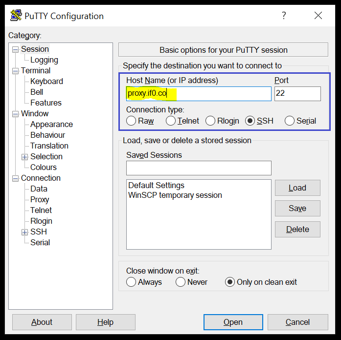
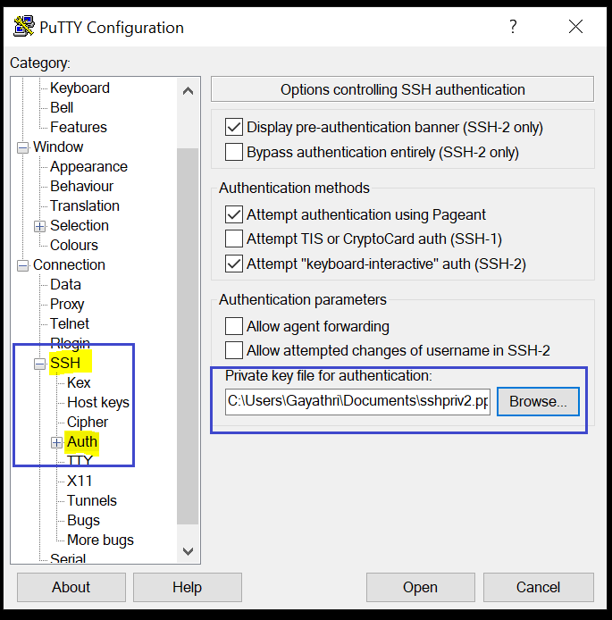
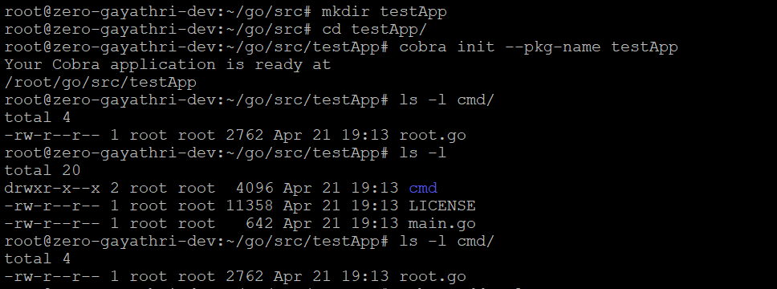
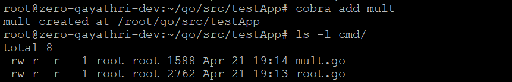
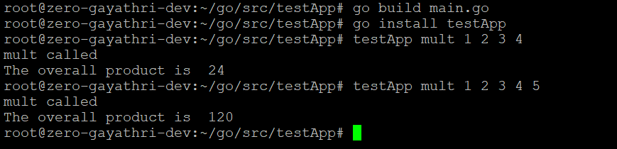

# ToDo

- Implement https://github.com/semantic-release/semantic-release

### **Setting up:**

To be able to use `if0` app, `cd` to `if0` directory, and run `go install if0`. This creates an executable in the GOPATH `bin` directory.

### Usages of **config** command:

1. `if0 config`

    Prints the current running configuration on the console.
    If there is no current running configuration available, `if0` creates on at `~/.ifo/if0.env`
2. `if0 config --set varName=varValue`
    
    Updates the environment variable  _varName_ with _varValue_
    
    Multiple variables can also be set using comma-separated key-value pairs. For example: `if0 config --set "varName1=varValue1,varName2=varValue2"`
3. `varName=varValue if0 config <args>`

    Updates the variable _varName_ with value _varValue_ before running the `if0` command 
4. `if0 config --add=path/to/configFile.env` or `if0 config -z --add=path/to/configFile.env`

    Takes a backup of the current running configuration file (`if0.env`), and replaces it with the configuration from `configFile.env`
    
    `-z` or `--zero` adds or updates the config file in `~/.ifo/.environments` directory
5. `if0 config --merge --src=SRC_CONFIG.env [--dst=DST_CONFIG.env]`
    
    `--merge` or `-m`

    Takes a backup of `if0.env` and then merges it with configuration from `SRC_CONFIG.env` 
    
    `--dst` flag is optional. By default, `if0.env` file is chosen.
    
    This command can also be used to merge zero-cluster configuration files with the use of `--zero` or `-z`flag. 
    
    `--dst` flag is again optional; in this case, `dst` file name is assumed to be the same as the `src` config file name. This requires the user to know the destination file name.
    
### **Developer Documentation**

1. ##### Making use of SSH Keys to login to a server via PUTTY  

    Enter your HOST Name or IP address, choose SSH as the 'Connection Type'
    
    
    
    
    Choose 'Auth' under 'SSH' and provide private key 
    
    
    
    
2. ##### Installing go 
    
    * Download the latest binary from https://golang.org/dl/ and run it.
    * Ensure that the GOPATH (go workspace) is added to the PATH environment variable. This can be done automatically by choosing the option in the installer (in windows) or manually.  
    * The GOPATH should typically contain the following folders: `bin, pkg, src`
    
    OS-specific installation instructions can be found here: https://golang.org/doc/install
  
    **For windows**
    
    https://www.freecodecamp.org/news/setting-up-go-programming-language-on-windows-f02c8c14e2f/
    
    **For ubuntu**
    
    https://medium.com/better-programming/install-go-1-11-on-ubuntu-18-04-16-04-lts-8c098c503c5f
    
    **For MAC OS X**
    
    https://medium.com/golang-learn/quick-go-setup-guide-on-mac-os-x-956b327222b8

3. ##### Installing and Setting up Cobra

    * Run the following command to install cobra: `go get github.com/spf13/cobra/cobra`
    
    * Creating initial application code
    
        1. To create the initial application code, use the following command: `cobra init --pkg-name path/to/appName`
    
    
        2. To add new commands to your app, use the following command: `cobra add cmdName`. This will add the bare-bones code necessary for the command. 
    
    
        3. After including code for the necessary functionality, run the following commands to create a binary for the app. This binary is saved in `GOPATH/bin`.
        
        
    Reference: https://github.com/spf13/cobra/blob/master/cobra/README.md

  
